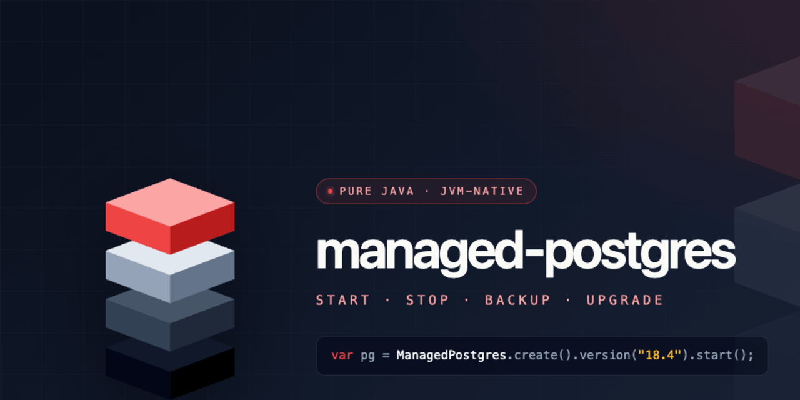

<div align="center">



<br>

**A real PostgreSQL, started from Java in one line.**
No Docker. No install. No root. No `initdb` rituals.

[](https://central.sonatype.com/artifact/eu.virtualparadox/managed-postgres-core)
[](https://github.com/virtualparadoxorg/managed-postgres/actions/workflows/ci.yml)
[](#compatibility)
[](#spring-boot--one-line-and-your-app-has-a-database)
[](#compatibility)
[](LICENSE)

📚 **[Read the documentation →](docs/README.md)**

</div>

---

## What is this?

`managed-postgres` runs a **real, native PostgreSQL** as a child process of your JVM — managed
entirely from Java. The official PostgreSQL binaries are **downloaded on first run, verified against
a pinned Ed25519 signature, cached, and started** as your own user, on a random loopback port.

```java
try (var pg = ManagedPostgres.create().version("18.4").start()) {

    String version = JdbcClient.create(pg.dataSource())
            .sql("select version()")
            .query(String.class)
            .single();

    System.out.println(version);
}
```

That's it. No container runtime. No system package. No `sudo`. No `data/` directory you have to
`chown`. Just a database, where and when your code wants one.

> **No PostgreSQL installed? Good — there isn't supposed to be.** That first `.start()` fetches the
> right native build for your *exact* platform, verifies its signature, and caches it. On Alpine?
> On **musl**? It just works — nothing to compile, nothing to match by hand.

---

## Why you'll like it

- 🧊 **Nothing to install — ever.** No Postgres on the machine? That's the point. The official
  binaries are **downloaded on first run** from the
  [`managed-postgres-runtimes`](https://github.com/virtualparadox/managed-postgres-runtimes) repo,
  **SHA-256 + Ed25519 verified**, and cached. No apt-get, no brew, no `docker pull`, no `initdb`.
- 🌍 **Runs anywhere your JVM runs.** Pre-built native runtimes for **macOS** (x86-64 / arm64),
  **Linux** (x86-64 / arm64, **glibc *and* musl**) and **Windows** (x86-64). On Alpine? On musl?
  It just works — the right build is matched to your exact platform automatically.
- 🔐 **No root. User space only.** Postgres runs as *you*, on `127.0.0.1`, on an ephemeral port —
  no privileged ports, no system service, no daemon. (PostgreSQL itself refuses to run as root — so user space is the natural, intended way to run it.)
- ✨ **A genuinely beautiful API.** A fluent, lambda-free, value-object-free DSL — every knob is a
  fluent step. The beautiful API is a product feature, not an afterthought.
- ♻️ **Disposable runtime, sacred data.** Throw the binaries away anytime; your storage is yours.
  Every mutating filesystem step is recoverable.
- 🔌 **Outlives your JVM — and reconnects.** Opt in, and the database keeps running after your
  process exits; the next run *reattaches* to the live instance instead of booting a second one.
- 🧰 **Full lifecycle.** start · stop · status · **backup** · **restore** · **upgrade** · doctor.

---

## Spring Boot — one line and your app has a database

Add the starter and flip one switch. `managed-postgres` starts PostgreSQL *before* Spring Boot's
datasource auto-configuration and publishes `spring.datasource.*`, so your app wires up against a
real database with **zero code changes**.

```xml
<dependency>
  <groupId>eu.virtualparadox</groupId>
  <artifactId>managed-postgres-spring-boot-4-starter</artifactId>
  <version>1.0.1</version>
</dependency>
```

```yaml
# application.yml
managed-postgres:
  enabled: true        # ← that's the one move
  version: "18.4"      # optional; defaults to the latest verified runtime
```

Boot your app. There is a PostgreSQL behind your `DataSource`, `JdbcTemplate`, JPA — whatever you use.
No `docker-compose.yml`, no Testcontainers, no local install.

On **Spring Boot 3**? Use `managed-postgres-spring-boot-3-starter` instead — same properties, same behaviour.

---

## Plain Java — the library

```xml
<dependency>
  <groupId>eu.virtualparadox</groupId>
  <artifactId>managed-postgres-core</artifactId>
  <version>1.0.1</version>
</dependency>
```

```java
try (RunningPostgres pg = ManagedPostgres.create().version("18.4").start()) {
    var db  = pg.connectionInfo();          // host / port / database / username / password
    var url = pg.jdbcUrl();                 // jdbc:postgresql://127.0.0.1:<port>/postgres
    var ds  = pg.dataSource();              // a ready javax.sql.DataSource
    // ... use any JDBC client you like
}
```

Need a temporary database that vanishes on close? `ManagedPostgres.temporary()`.
Need a persistent project-local one? `ManagedPostgres.create()` (the default).

---

## The DSL

Everything is a fluent step — no hand-built value objects, no lambdas, no leaky config:

```java
ManagedPostgres.create()
    .version("18.4")
    .withDownloadedRuntime()
        .fromOfficialRepository()
    .storageProjectLocal(".local/pg")
    .credentials("app", "s3cr3t")
    .network()
        .host("127.0.0.1")
        .randomPort()
    .cluster()
        .database("app")
        .owner("app")
        .extension("uuid-ossp")
    .serverConfiguration()
        .maxConnections(50)
        .sharedBuffers("256MB")
    .start();
```

---

## It can outlive your JVM — and reconnect to it

By default a database stops when you close it. Opt into survival with one step:

```java
var pg = ManagedPostgres.create()
    .version("18.4")
    .reuseExisting()        // keep running on exit + reattach if already up
    .start();
```

Now PostgreSQL **keeps running after your JVM exits**. The next run against the same project-local
storage doesn't boot a second server — it detects the live instance, checks that it's compatible, and
**reattaches** to it. Dev restarts, hot reloads and separate processes all share one warm database
instead of paying startup again.

---

## Watch it start

The first start downloads and verifies the runtime, so it takes a moment. By default every phase is
logged via SLF4J — `Downloading… 40%`, `initdb…`, `Ready in 7.3s`. Want to own it yourself — a progress
bar, MDC, your own pipeline? Pass listeners (plain objects, no lambdas required):

```java
ManagedPostgres.create()
    .version("18.4")
    .onProgress(new MyProgressBar())        // ManagedPostgresProgressListener
    .logs().toListener(new MyLogSink())     // PostgresLogListener — structured lines; SLF4J bridge off
    .start();
```

Progress phases: `RESOLVING_RUNTIME → DOWNLOADING` (with %) `→ VERIFYING → EXTRACTING → INITDB →
STARTING → WAITING_FOR_READY → READY` — or `ATTACHING` when it reconnects to a live instance. Log lines
arrive structured (`PostgresLogLine{ level, source, message }`), already secret-redacted.

---

## CLI

A standalone CLI (`managed-postgres-cli`) wraps the same engine:

```
managed-postgres  start | stop | status | backup | restore | upgrade | doctor
```

---

## Documentation

Full reference documentation lives in **[`docs/`](docs/README.md)**:

- 🚀 [Getting started](docs/getting-started.md) · [Concepts](docs/concepts.md)
- 📖 [DSL reference](docs/dsl-reference.md) · [Configuration reference](docs/configuration-reference.md) · [Connecting](docs/connecting.md)
- ⚙️ [Lifecycle](docs/lifecycle.md) · [Observability](docs/observability.md)
- 🔌 [Spring Boot](docs/spring-boot.md) · [CLI](docs/cli.md)
- 📦 [Runtime distribution & security](docs/runtime-distribution.md) · [Compatibility](docs/compatibility.md)
- 🛟 [Recipes](docs/recipes.md) · [Troubleshooting](docs/troubleshooting.md)

---

## Compatibility

| | |
|---|---|
| **Java** | 21+ |
| **Spring Boot** | 3 and 4 (separate starters) |
| **PostgreSQL** | 16, 17, 18 (default runtime: 18.4) |
| **OS / arch** | macOS x86-64 · macOS arm64 · Linux x86-64 (glibc/musl) · Linux arm64 (glibc/musl) · Windows x86-64 |

---

## How it works

1. **Resolve** the runtime for your OS × arch × libc.
2. **Download** the bundle from the public runtimes repo (skipped if cached).
3. **Verify** the SHA-256 checksum and the detached **Ed25519** signature against a pinned public key.
4. **Extract** to a user-writable cache (idempotent, recoverable).
5. **`initdb` + start** PostgreSQL as a child process on a loopback port — as your own user.
6. Hand you a `RunningPostgres` with connection info, a `DataSource`, and the full lifecycle.

---

## Build from source

Java 21 is the baseline. From the repo root:

```bash
./mvnw verify
```

---

## Status

**Released.** `1.0.1` is published on Maven Central — the coordinates above work as-is. The engine,
supply chain (build → publish → sign → verify → download) and the public API are complete and green.

---

## License

[Apache License 2.0](LICENSE).

Brand assets live in [`docs/assets`](docs/assets) — see [`docs/assets/README.md`](docs/assets/README.md)
for usage, colors and typography.
